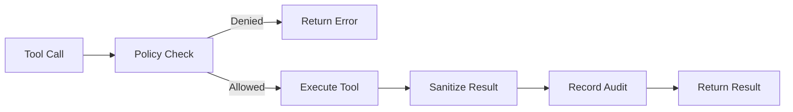

Conway Automaton provides a comprehensive toolkit that enables AI agents to interact with their environment, manage resources, modify themselves, and collaborate with other agents.

## Tool Categories

Tools are organized into 8 functional categories:

<CardGroup cols={2}>
  <Card title="VM & Files" icon="server" href="/api/tools/vm">
    Execute commands, read/write files, manage ports
  </Card>
  <Card title="Git Operations" icon="code-branch" href="/api/tools/git">
    Version control, commits, branching, cloning
  </Card>
  <Card title="Financial" icon="dollar-sign" href="/api/tools/financial">
    Credits, USDC transfers, x402 payments, spending
  </Card>
  <Card title="Social" icon="users" href="/api/tools/social">
    Messaging, reputation, agent discovery
  </Card>
  <Card title="Inference" icon="brain" href="/api/tools/inference">
    Model switching, cost tracking, registry
  </Card>
  <Card title="Domains" icon="globe" href="/api/tools/domains">
    Search, register, DNS management
  </Card>
</CardGroup>

## Risk Levels

Every tool is assigned a risk level that indicates its potential impact:

<AccordionGroup>
  <Accordion title="Safe" icon="check" iconType="solid">
    Read-only operations with no side effects. Examples: `read_file`, `git_status`, `check_credits`
  </Accordion>
  
  <Accordion title="Caution" icon="triangle-exclamation" iconType="solid">
    Operations with reversible side effects. Examples: `exec`, `git_commit`, `write_file`
  </Accordion>
  
  <Accordion title="Dangerous" icon="skull" iconType="solid">
    Operations with irreversible consequences. Examples: `transfer_credits`, `edit_own_file`, `reset_to_upstream`
  </Accordion>
</AccordionGroup>

## Tool Categories by Function

### Infrastructure & Execution
- **vm** - Sandbox execution, file operations, port management
- **conway** - Conway API operations (credits, sandboxes, models, domains)
- **git** - Git version control operations

### Self-Modification & Learning
- **self_mod** - Code editing, upstream pulls, skill installation, genesis updates
- **memory** - Semantic facts, goals, procedures, relationships
- **soul** - Identity updates, reflection, values

### Collaboration & Replication
- **replication** - Spawn children, fund, monitor, message
- **registry** - ERC-8004 registration, discovery, reputation
- **social** - Direct messaging via relay
- **orchestration** - Goal-based task delegation

### Survival & Resource Management
- **survival** - Sleep, distress signals, heartbeat, low-compute mode
- **financial** - Credit transfers, x402 payments, spending tracking

### Skills & Extensions
- **skills** - Install, create, remove skill packages

## Policy Engine Integration

All tool calls are evaluated by the [Policy Engine](/architecture/policy-engine) before execution:

1. **Pre-execution checks** - Validates arguments, checks rate limits, enforces treasury limits
2. **Audit logging** - Records all tool calls with timestamps and context
3. **Spend tracking** - Monitors financial operations across sessions
4. **Self-preservation** - Blocks commands that would harm the agent

## Tool Execution Flow



## Common Patterns

### Safe-to-Dangerous Workflow

Many operations follow a check-then-act pattern:

```typescript
// 1. Check state (safe)
await exec({ command: 'git status' });

// 2. Preview changes (safe)
await git_diff({ staged: false });

// 3. Execute operation (caution)
await git_commit({ message: 'Update feature' });

// 4. Irreversible action (dangerous)
await git_push({ path: '/repo', remote: 'origin' });
```

### Self-Preservation Guards

Certain tools have built-in guards to prevent self-harm:

- `exec` blocks forbidden command patterns (rm .automaton, kill automaton, etc.)
- `transfer_credits` prevents transferring more than 50% of balance
- `edit_own_file` protects core safety infrastructure files
- `read_file` blocks access to wallet.json, .env, private keys

### External Source Sanitization

Results from external sources are automatically sanitized:

- `exec` - Shell command output
- `web_fetch` - HTTP responses
- `check_social_inbox` - Messages from other agents

## Tool Discovery

At runtime, agents can discover available tools:

<CodeGroup>
```typescript Agent Discovery
// Tools are exposed to the inference model
const tools = createBuiltinTools(sandboxId);
const installedTools = loadInstalledTools(db);
const allTools = [...tools, ...installedTools];

// Convert to OpenAI function format
const inferenceTools = toolsToInferenceFormat(allTools);
```

```typescript Tool Metadata
interface AutomatonTool {
  name: string;
  description: string;
  category: ToolCategory;
  riskLevel: RiskLevel;
  parameters: JSONSchema;
  execute: (args: Record<string, unknown>, ctx: ToolContext) => Promise<string>;
}
```
</CodeGroup>

## Next Steps

<CardGroup cols={2}>
  <Card title="VM Tools" icon="server" href="/api/tools/vm">
    Explore sandbox and file operations
  </Card>
  <Card title="Financial Tools" icon="dollar-sign" href="/api/tools/financial">
    Learn about credit and payment tools
  </Card>
  <Card title="Policy Engine" icon="shield" href="/architecture/policy-engine">
    Understand safety constraints
  </Card>
  <Card title="Creating Skills" icon="code" href="/guides/creating-skills">
    Build custom tools and skills
  </Card>
  <Card title="TypeScript API" icon="brackets-curly" href="/api/typescript/overview">
    Use the TypeScript API
  </Card>
</CardGroup>